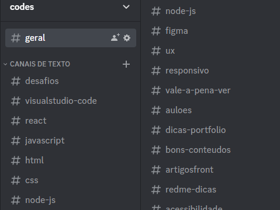

# Dicas que utilizei

Começar na programação é uma tarefa bem complexa, por existirem várias tecnologias e caminhos para seguir, é normal que tenhamos dificuldades no começo. Quando eu estava no começo dos meus estudos, pensei diversas vezes se aquilo realmente era para mim, mas eu estava decidido de que levaria aquilo em diante já que desde a infância eu era apaixonado por tecnologia e como as coisas funcionavam.

## 1. Decida-se:

Antes de começar a estudar, saiba qual tecnologia e, qual ramo você quer seguir, por exemplo, decidi que iria estudar os conteúdos do front-end, já que eu gostava de ‘design’ e para mim, seria mais adaptável. Tenho amigos que foram para o back-end e começaram pelo Java já que gostavam de Minecraft e queriam aprender a fazer novos plugins para seus servidores.

## 2. Onde estudar / Como estudar:

Hoje em dia, existem milhares de formas e conteúdos sobre tecnologia na internet e isso permite que pessoas autodidatas consigam aprender muito em diversos lugares diferentes, comecei a assistir aulas no Youtube em canais como "Curso em Vídeo", depois decidi que iria investir em alguma plataforma de estudo como "Alura" e "Udemy", hoje faço uma mesclagem de onde estudar e acabo vendo conteúdos no "Stack Overflow", Grupos do Discord, GitHub, Linkedin, principalmente as documentações das tecnologias e também utilizo alguns sites de challenge para colocar em prática o que venho aprendendo.

## 3. Salve seu conteúdo de estudo:

Faça um grupo no Discord, sozinho ou com amigos onde você possa salvar os conteúdos que forem importantes, ou que você pensa que serão importantes no seu aprendizado, tenho um grupo no discord com diversos tópicos aonde vou salvando tudo que vou aprendendo desde quando comecei, separei ele por programas, tecnologias, linguagens, e vou salvando tudo que acho importante lá para sempre ter um local de consulta enquanto desenvolvo meus projetos pessoais, vi que isso me ajudou muito a conseguir adquirir conhecimentos no HTML, CSS e JS, salvei todas as tags básicas e importantes do HTML para conseguir desenvolver meus primeiros sites, propriedades do CSS que no começo eram complicadas de lembrar o que faziam, lembre-se também de sempre consultar a documentação das linguagens quando estiver desenvolvendo algo novo.

## 4. Challenges para praticar:

É muito difícil aprender de verdade apenas vendo as aulas, então recomendo fortemente que utilize sites de desafios onde você pode pôr em prática tudo que aprendeu.

* [**<u>W3Schools</u>** - Seu conteúdo inclui tutoriais e referências relacionadas a tecnologias](https://www.w3schools.com/)

* [**<u>Codecademy</u>** - é um site que possui uma plataforma interativa online e oferece aulas gratuitas](https://www.codecademy.com/)

* [**<u>HackerRank</u>** - é uma empresa de tecnologia que se concentra em desafios competitivos de programação](https://www.hackerrank.com/)

* [**<u>LeetCode</u>** - LeetCode é a melhor plataforma para ajudá-lo a aprimorar suas habilidades e expandir seu conhecimento](https://leetcode.com/)

* [**<u>Flexbox Froggy</u>** - Um jogo para aprender CSS flexbox](https://flexboxfroggy.com/)

* [**<u>Grid Garden</u>** - Um jogo para aprender CSS grid](https://cssgridgarden.com/)

## 5. Repasse seu conhecimento:

Dizem que a melhor forma de aprender é ensinando, se você tem algum amigo(a) que também estuda as tecnologias que você já conhece, se juntem para conversar e trocar conhecimento assim vocês podem aprender juntos, encontre também comunidades no discord/linkedin/github para tirar a dúvida de outras pessoas e conhecer novas pessoas, dessas formas você consegue aprofundar seus conhecimentos e pôr em prática todo aquele conteúdo que você já aprendeu.

## 6. Estude inglês:

Estudar inglês é fundamental para você que quer se tornar um programador, os melhores conteúdos sobre linguagens de programação e algoritmos são inscritos em inglês, os melhores vídeos tutoriais, seminários, palestras sobre programação, tecnologias, são em inglês.

As documentações de APIs públicas, plataformas e linguagens de programação são em inglês também, diversos cursos gratuitos que são desenvolvidos por boas universidades do mundo todo são em inglês, ser fluente no inglês vai te ajudar muito no estudo da programação.

